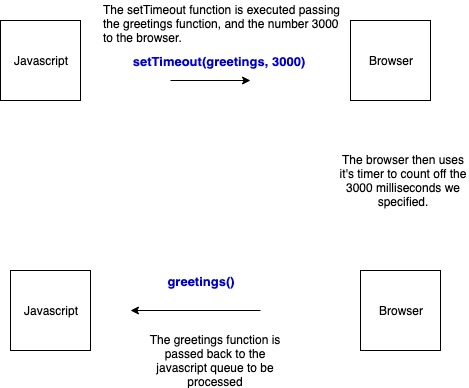

Question:

Which of the following is part of Javascript?

```
setTimeout
parseInt
fetch
onResize
```

If you said 'only parseInt, the rest are not part of javascript' then congratulations ... you probably don't need to read further.

For the remainder however, it comes as a surprise to a lot of people that setTimeout isn't part of Javascript. If you don't believe me, go to the official spec for Javascript (ECMA=262)

https://www.ecma-international.org/ecma-262

and try to find setTimeout. It's not there. So if it's not there ... and if fetch isn't part of Javascript, nor onResize ... then how does Javascript know what Im talking about when I use these commands in my scripts.

Ladies and Gentlemen, it's time to meet ... the BOM.


The Browser Object Model you can think of as simply 'the browser'. It contains 'all of the browser things'. The DOM, that's part of the BOM. Javascript, yes that's inside the BOM. Essentially the BOM is a collection of objects. Even the Window object.

The Window object? Isn't that the global object in Javascript?

Well yes it is. And this is where we need to learn about the relationship (and seperation) between Javascript and the BOM.

```
const greetings = () = > {
  console.log('Hello there.');
}

setTimeout(greetings, 3000);
```

Here's a simple function. We call setTimeout so that after 3 seconds it console logs out a greeting.

But to do this very simple task involves co-operation between Javascript and the BOM.

So the greetings function. That's Javascript.

But the setTimeout function ... well thats a function in the window object that has been provided by the BOM. Javascript has no clue as to what setTimeout does. It just knows that the window object has provided it, so it dutifully calls setTimeout, passing with it the 'greetings' function and a time (3000 milliseconds). The browser then uses it's internal timer to count to 3000. Once complete, it knows its needs to pass the greetings function BACK to the javascript to be processed. So after 3 seconds, the greetings function is put onto the javascript queue which in turn is then placed onto the callstack. Javascript then executes the greetings function which then console logs out a 'Hello There'.



So quick recap. A call to setTimeout involves passing a function from Javascript, to the browser. The browser uses its own timer to count to 3000, then passes BACK to javascript the function you passed in ie the greetings function.

So this is all well and good, but why is this important?

Well you have just discovered how Javascript ... which is completely synchronous and single threaded, is able to provide asynchronous functionality.

If it didnt have the browser to lend a helping hand, it would literally have to block EVERYTHING for 3 seconds, until the timer has finished then it would continue on with the script. Now imagine having multiple asynchronous calls, this would be a disaster with javascipt constantly locking up all the time (we'll ignore the fact that Javascript doesn't even have timer functionality to do this anyway).

So anything to do with asynchronicity is, in reality, passed to the browser to processs ... Javascript then continues along on its merry way with the rest of its functions. Once the browser has a return value for Javascript it pops it on the queue, to be processed when Javascript is ready for it.

And this happens with a LOT of the functions you use. Fetch, onResize ... these are all provided by the browser through the window object. Javascript doesn't have a clue what they do, but it knows that the browser does. So it invokes these functions at which point the browser says 'Ive got this ...' and its the browser which in fact deals with the function ... passing the return value back to javascript.

So what functions, properties etc ARE part of javascript? Well check out this handy page by MDN which goes through them.

https://developer.mozilla.org/en-US/docs/Web/JavaScript/Reference/Global_Objects

But the big takeaway is this ... What you probably thought was 'Javascript' is in reality two different things, Javascript and the Browser working hand in hand. Passing values and functions to each other to be processed in a clever non-blocking way.

[back](./)
